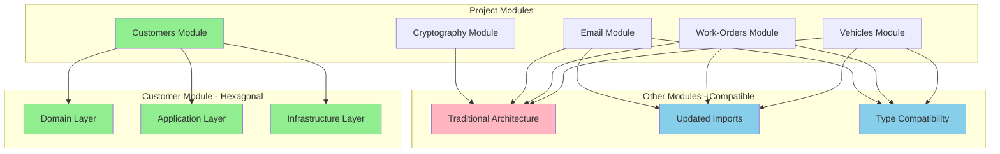

# Documentation Index

## Architecture Documentation

### [Hexagonal Architecture Migration Guide](./hexagonal-architecture-migration.md)

A comprehensive guide demonstrating the migration of the Customer module from traditional layered architecture to pure Hexagonal Architecture (Ports & Adapters).

**What you'll learn:**
- ✅ Architecture comparison (Before vs After)
- ✅ Step-by-step migration process
- ✅ Domain layer refactoring with Value Objects
- ✅ CQRS pattern implementation
- ✅ Ports & Adapters pattern
- ✅ Testing strategy and best practices
- ✅ Benefits achieved and lessons learned

## Key Concepts Covered

### 🏗️ Hexagonal Architecture
- **Domain Layer**: Core business logic and rules
- **Application Layer**: Use cases and orchestration
- **Infrastructure Layer**: External system adapters
- **Ports & Adapters**: Clean separation of concerns

### 🎯 Domain-Driven Design
- **Rich Domain Models**: Entities with behavior
- **Value Objects**: Encapsulated validation
- **Domain Services**: Complex business rules
- **Aggregates**: Consistency boundaries

### 🔄 CQRS Pattern
- **Commands**: Write operations
- **Queries**: Read operations
- **Use Cases**: Command/Query handlers
- **Separation**: Optimized for different concerns

### 🧪 Testing Strategy
- **Unit Tests**: Fast, isolated tests
- **Integration Tests**: Component interaction tests
- **E2E Tests**: Full system tests
- **Test Pyramid**: Optimal test distribution

## Architecture Benefits

### ✅ Maintainability
- Centralized business logic
- Clear separation of concerns
- Easy to understand and modify

### ✅ Testability
- Each layer testable in isolation
- Mock-friendly design
- Fast and reliable tests

### ✅ Flexibility
- Easy to swap implementations
- Simple to add new features
- Technology-agnostic core

### ✅ Scalability
- CQRS enables read/write optimization
- Clean boundaries for microservices
- Performance-focused design

## Project Structure Overview

## Getting Started

1. **Read the Migration Guide**: Start with the [Hexagonal Architecture Migration Guide](./hexagonal-architecture-migration.md)
2. **Explore the Code**: Examine the Customer module implementation
3. **Run the Tests**: Verify the architecture with the test suite
4. **Apply Patterns**: Use these patterns in your own modules

## Contributing

When contributing to this project, please follow the established patterns:

1. **Domain First**: Start with domain entities and value objects
2. **Ports & Adapters**: Define interfaces before implementations
3. **CQRS**: Separate commands and queries
4. **Test Coverage**: Maintain high test coverage
5. **Documentation**: Update documentation for new patterns

## Resources

- [Hexagonal Architecture by Alistair Cockburn](https://alistair.cockburn.us/hexagonal-architecture/)
- [Domain-Driven Design by Eric Evans](https://domainlanguage.com/ddd/)
- [Clean Architecture by Robert C. Martin](https://blog.cleancoder.com/uncle-bob/2012/08/13/the-clean-architecture.html)
- [CQRS Pattern by Microsoft](https://docs.microsoft.com/en-us/azure/architecture/patterns/cqrs)