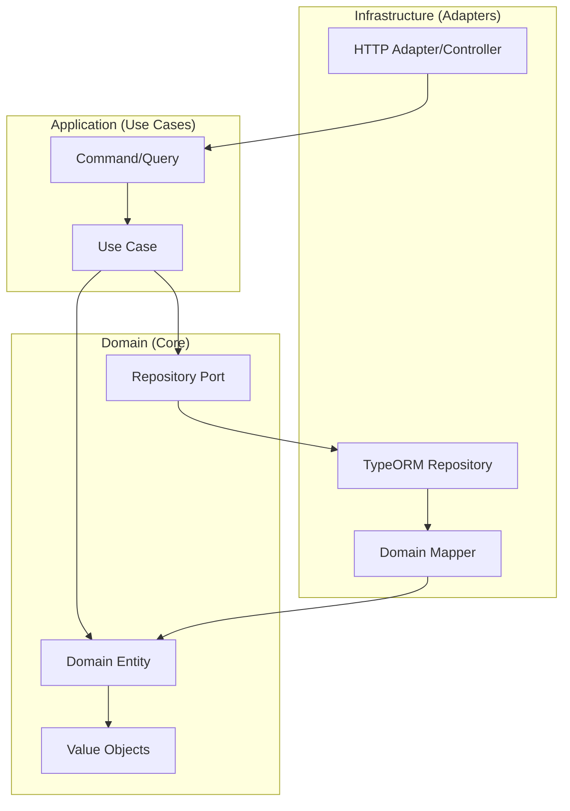

# ADR-001: Arquitetura Hexagonal (Ports & Adapters)

**Status:** Accepted  
**Data:** 2024-12-19  
**Autores:** Equipe de Arquitetura

## Contexto

O sistema de gestão de garagem necessita de uma arquitetura que:

- Isol a lógica de negócio de detalhes de implementação
- Facilite testes unitários e de integração
- Permita trocar implementações (banco de dados, frameworks, APIs) sem impactar o domínio
- Seja mantível e extensível a longo prazo
- Suporte Domain-Driven Design (DDD) para modelar complexidade do negócio

Após análise de diferentes abordagens arquiteturais, foi necessário escolher um padrão que atenda esses requisitos.

## Decisão

**Adotaremos Arquitetura Hexagonal (Ports & Adapters) como padrão arquitetural principal do sistema.**

A arquitetura será organizada em três camadas principais:

1. **Domain Layer (Core)**: Entidades ricas, value objects, ports (interfaces), regras de negócio
2. **Application Layer**: Use cases, commands, queries (CQRS), orquestração
3. **Infrastructure Layer (Adapters)**: Implementações concretas (TypeORM, HTTP, criptografia)

## Consequências

### Positivas

1. **Isolamento do Domínio**:
   - Lógica de negócio não depende de frameworks ou tecnologias
   - Domínio pode ser testado sem infraestrutura
   - Fácil entender regras de negócio sem navegar código de infraestrutura

2. **Testabilidade**:
   - Use cases podem ser testados com mocks de ports
   - Testes unitários rápidos e isolados
   - Testes de integração focados apenas em adapters

3. **Flexibilidade Tecnológica**:
   - Trocar TypeORM por Prisma sem impactar domínio
   - Adicionar novos adapters (GraphQL, gRPC) sem modificar use cases
   - Migrar para outro framework sem reescrever lógica de negócio

4. **Manutenibilidade**:
   - Separação clara de responsabilidades
   - Código organizado e previsível
   - Fácil localizar onde implementar novas funcionalidades

5. **DDD Compatível**:
   - Domain layer pode implementar DDD puro (entities, value objects, aggregates)
   - Application layer implementa use cases do domínio
   - Infrastructure apenas persiste e expõe

6. **CQRS Natural**:
   - Separação entre commands (escrita) e queries (leitura)
   - Permite otimizações independentes para leitura e escrita

### Negativas

1. **Complexidade Inicial**:
   - Curva de aprendizado para desenvolvedores não familiarizados
   - Mais arquivos e estrutura de pastas
   - **Mitigação**: Documentação detalhada e exemplos no código

2. **Overhead de Código**:
   - Necessário criar interfaces (ports) e implementações (adapters)
   - Mappers entre domain e infrastructure
   - **Mitigação**: Benefícios superam o overhead; geradores de código podem ajudar

3. **Desempenho**:
   - Camadas adicionais podem adicionar overhead mínimo
   - **Mitigação**: Overhead é desprezível comparado a I/O de banco/rede; otimizações pontuais quando necessário

4. **Migração de Código Legado**:
   - Código existente precisa ser refatorado
   - **Mitigação**: Migração incremental (já iniciada no módulo Customers); módulos novos seguem o padrão

## Implementação

### Estrutura de Módulos

```
src/modules/{module-name}/
├── domain/
│   ├── entities/           # Entidades de domínio (rich domain models)
│   ├── value-objects/      # Value objects (Document, Email, Phone, etc.)
│   ├── repositories/       # Ports (interfaces de repositórios)
│   └── ports/              # Outros ports (Cryptography, Email, etc.)
├── application/
│   ├── commands/           # Commands (write operations)
│   ├── queries/            # Queries (read operations)
│   ├── use-cases/          # Use case handlers
│   └── dtos/               # DTOs da camada de aplicação
├── infrastructure/
│   ├── adapters/           # Implementações de adapters (HTTP, etc.)
│   ├── repositories/       # Implementações TypeORM
│   ├── mappers/            # Mappers domain ↔ infrastructure
│   └── entities/           # Entidades TypeORM (ORM models)
└── presentation/           # (Opcional) Controllers, DTOs de apresentação
    ├── controllers/
    └── dtos/
```

### Fluxo de Dados



### Princípios Aplicados

1. **Dependency Inversion**: Domain não depende de Infrastructure; Infrastructure implementa Ports do Domain
2. **Single Responsibility**: Cada camada tem responsabilidade única e bem definida
3. **Open/Closed**: Novos adapters podem ser adicionados sem modificar domain/application
4. **Interface Segregation**: Ports específicos e focados (não interfaces "god")

## Status de Migração

- ✅ **Customers Module**: 100% migrado para Hexagonal Architecture
- ✅ **Users Module**: 100% migrado para Hexagonal Architecture  
- ⚠️ **Outros Módulos**: Compatíveis, migração incremental conforme necessidade

## Referências

- Documentação de migração: `garage-management-system/docs/hexagonal-architecture-migration.md`
- [Hexagonal Architecture by Alistair Cockburn](https://alistair.cockburn.us/hexagonal-architecture/)
- [Clean Architecture by Robert C. Martin](https://blog.cleancoder.com/uncle-bob/2012/08/13/the-clean-architecture.html)
- Módulo exemplo: `garage-management-system/src/modules/customers/`

