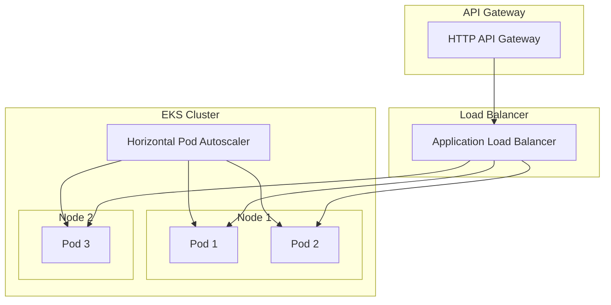

# ADR-003: Kubernetes e Estratégias de Escalabilidade

**Status:** Accepted  
**Data:** 2024-12-19  
**Autores:** Equipe de Arquitetura

## Contexto

O sistema de gestão de garagem precisa:

- Escalar horizontalmente conforme demanda
- Garantir alta disponibilidade (uptime)
- Reduzir custos através de autoscaling (não pagar por recursos ociosos)
- Suportar picos de tráfego (ex: início do expediente, relatórios mensais)
- Facilitar deploy e rollback de versões
- Isolar recursos por namespace/ambiente

Foi necessário escolher uma plataforma de orquestração de containers e definir estratégias de escalabilidade.

## Decisão

**Amazon EKS (Elastic Kubernetes Service) será utilizado para orquestração de containers, com as seguintes estratégias de escalabilidade:**

1. **Cluster Autoscaling**: EKS Node Groups com auto-scaling (1-3 nodes)
2. **Horizontal Pod Autoscaler (HPA)**: Escala pods baseado em CPU e memória (1-5 replicas)
3. **Vertical Pod Autoscaler (VPA)**: (Futuro) Ajuste automático de requests/limits
4. **Application Load Balancer (ALB)**: Distribuição de carga entre pods
5. **Health Checks**: Liveness e readiness probes para garantir disponibilidade

## Consequências

### Positivas

1. **Escalabilidade Automática**:
   - Sistema escala automaticamente conforme carga
   - Reduz necessidade de intervenção manual
   - Otimiza custos (escala para baixo quando não há demanda)

2. **Alta Disponibilidade**:
   - Múltiplos pods garantem que falhas não afetem o serviço
   - Rolling updates sem downtime
   - Health checks removem pods não saudáveis do load balancer

3. **Isolamento e Segurança**:
   - Namespaces isolam ambientes (dev, staging, prod)
   - Network policies (futuro) controlam tráfego entre pods
   - Secrets gerenciados de forma segura

4. **Flexibilidade de Deploy**:
   - Deploy blue/green ou canary via Kubernetes
   - Rollback rápido em caso de problemas
   - Versionamento de imagens Docker facilita rastreabilidade

5. **Ecosistema Maduro**:
   - Ferramentas e ferramentas amplamente disponíveis
   - Comunidade grande e documentação extensa
   - Integração com ferramentas CI/CD

6. **Resource Management**:
   - Requests e limits garantem QoS (Quality of Service)
   - Previne que um pod consuma todos os recursos do node
   - Permite planejamento de capacidade

### Negativas

1. **Complexidade Operacional**:
   - Kubernetes tem curva de aprendizado
   - Requer conhecimento de conceitos (pods, services, deployments, etc.)
   - **Mitigação**: Documentação, treinamento, e uso de abstrações (Helm charts)

2. **Custos**:
   - EKS tem custo de control plane (~$72/mês)
   - Nodes EC2 têm custos associados
   - **Mitigação**: Otimizar tamanho de nodes; usar spot instances para workloads não críticos; monitorar e ajustar

3. **Overhead de Recursos**:
   - Kubernetes consome recursos dos nodes (kubelet, kube-proxy, etc.)
   - **Mitigação**: Overhead é pequeno (~10-15%); benefícios superam o custo

4. **Debugging Mais Complexo**:
   - Problemas podem estar em múltiplas camadas (pod, service, ingress, node)
   - **Mitigação**: Logging centralizado (CloudWatch, New Relic); ferramentas como kubectl, k9s

## Implementação

### Configuração de HPA

```yaml
apiVersion: autoscaling/v2
kind: HorizontalPodAutoscaler
metadata:
  name: garage-api-hpa
spec:
  scaleTargetRef:
    apiVersion: apps/v1
    kind: Deployment
    name: garage-api
  minReplicas: 1
  maxReplicas: 5
  metrics:
    - type: Resource
      resource:
        name: cpu
        target:
          type: Utilization
          averageUtilization: 30
    - type: Resource
      resource:
        name: memory
        target:
          type: Utilization
          averageUtilization: 30
```

### Node Group Autoscaling

```hcl
resource "aws_eks_node_group" "main" {
  scaling_config {
    desired_size = 2
    max_size     = 3
    min_size     = 1
  }
}
```

### Health Checks

```yaml
livenessProbe:
  httpGet:
    path: /health
    port: 3000
  initialDelaySeconds: 30
  periodSeconds: 10

readinessProbe:
  httpGet:
    path: /health
    port: 3000
  initialDelaySeconds: 5
  periodSeconds: 5
```

### Arquitetura de Escalabilidade



## Estratégias de Escalabilidade

### 1. Horizontal Pod Autoscaling (HPA)

- **Métricas**: CPU e memória
- **Targets**: 30% CPU, 30% memória
- **Range**: 1-5 replicas
- **Behavior**: Scale up rápido, scale down gradual (stabilization window)

### 2. Cluster Autoscaling (Node Groups)

- **Range**: 1-3 nodes
- **Instance Type**: t3.medium (2 vCPU, 4GB RAM)
- **Trigger**: Quando pods não conseguem ser escalados por falta de recursos

### 3. Application-Level Scaling

- **Database Connection Pooling**: Limitar conexões por pod
- **Caching**: Redis (futuro) para reduzir carga no banco
- **Async Processing**: Filas para tarefas pesadas (futuro)

## Métricas e Monitoramento

- **CloudWatch**: Métricas de cluster, nodes, pods
- **Kubernetes Metrics Server**: Coleta métricas de CPU/memória para HPA
- **New Relic**: APM e monitoring de aplicação
- **Alerts**: Configurar alertas para:
  - Alta utilização de CPU/memória
  - Falhas de health checks
  - Nodes não disponíveis

## Melhorias Futuras

1. **Vertical Pod Autoscaler (VPA)**: Ajuste automático de requests/limits
2. **Cluster Autoscaler**: Escalar nodes automaticamente baseado em demanda
3. **Pod Disruption Budgets**: Garantir mínimo de pods durante manutenção
4. **Multi-AZ Deployment**: Distribuir pods em múltiplas zonas de disponibilidade
5. **Resource Quotas**: Limitar recursos por namespace
6. **Network Policies**: Controlar tráfego entre pods

## Referências

- [Kubernetes HPA Documentation](https://kubernetes.io/docs/tasks/run-application/horizontal-pod-autoscale/)
- [AWS EKS Best Practices](https://aws.github.io/aws-eks-best-practices/)
- Configuração EKS: `garage-management-infra/modules/eks/main.tf`
- HPA Config: `garage-management-system/k8s/hpa.yaml`

