# Hexagonal Architecture Migration - Customer Module

## Overview

This document demonstrates the migration of the Customer module from a traditional layered architecture to a pure Hexagonal Architecture (Ports & Adapters), following the latest industry best practices.

## Table of Contents

1. [Architecture Comparison](#architecture-comparison)
2. [Migration Process](#migration-process)
3. [Domain Layer](#domain-layer)
4. [Application Layer](#application-layer)
5. [Infrastructure Layer](#infrastructure-layer)
6. [Benefits Achieved](#benefits-achieved)
7. [Testing Strategy](#testing-strategy)

## Architecture Comparison

### Before: Traditional Layered Architecture

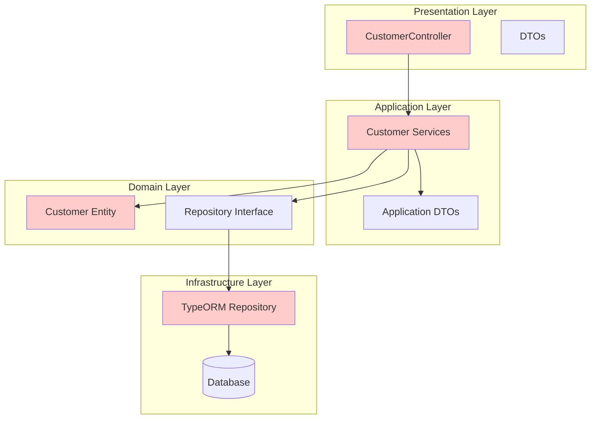

**Problems with Traditional Architecture:**
- ❌ Controllers contain business logic
- ❌ Services depend on DTOs from application layer
- ❌ Domain entities are anemic (data containers)
- ❌ Tight coupling between layers
- ❌ Difficult to test and maintain

### After: Hexagonal Architecture

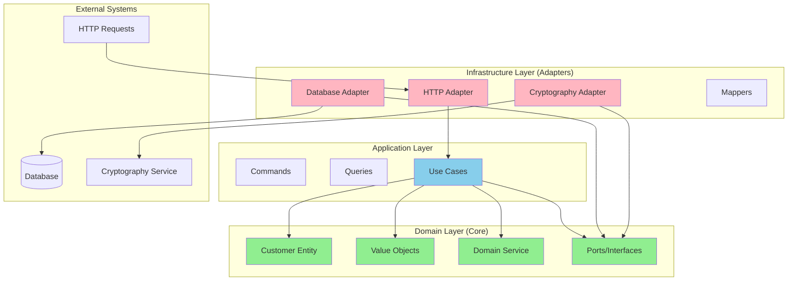

**Benefits of Hexagonal Architecture:**
- ✅ Domain is the center of the application
- ✅ All dependencies point inward to the domain
- ✅ Easy to test with mocks of ports
- ✅ Easy to swap implementations
- ✅ Rich domain model with business logic

## Migration Process

### Step 1: Domain Layer Refactoring

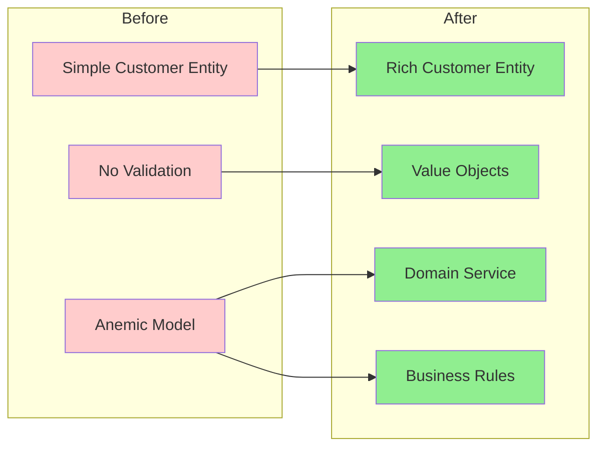

### Step 2: Application Layer Transformation

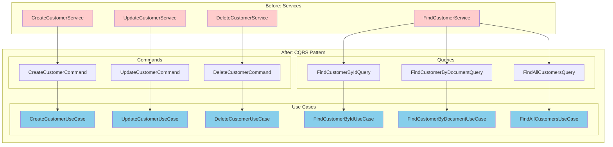

### Step 3: Infrastructure Layer Implementation

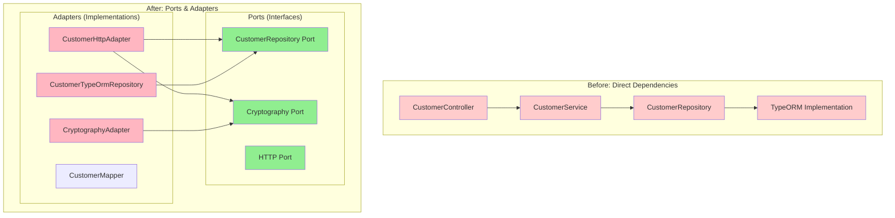

## Domain Layer

### Value Objects

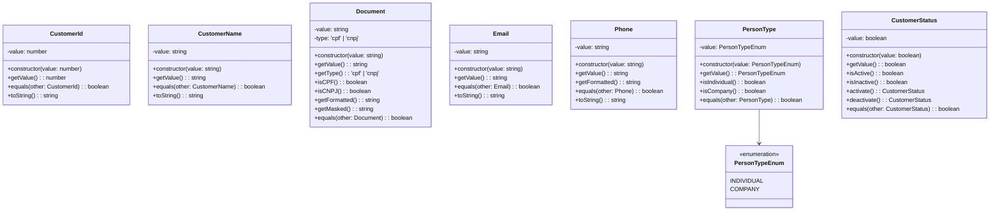

### Rich Domain Entity

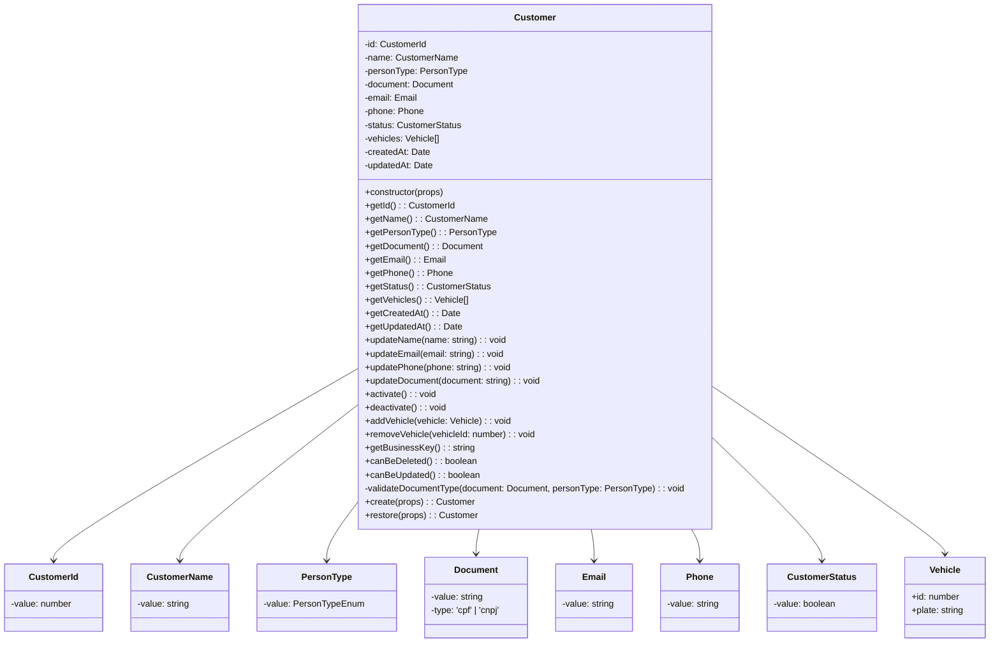

## Application Layer

### CQRS Pattern Implementation

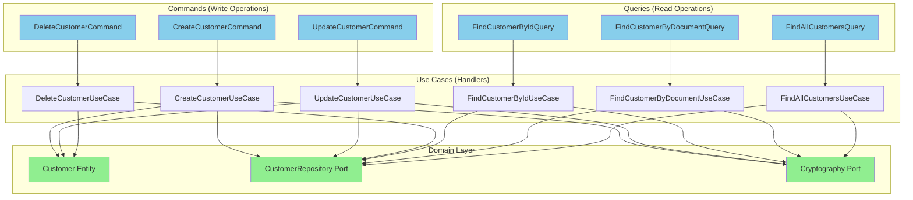

### Use Case Flow Example

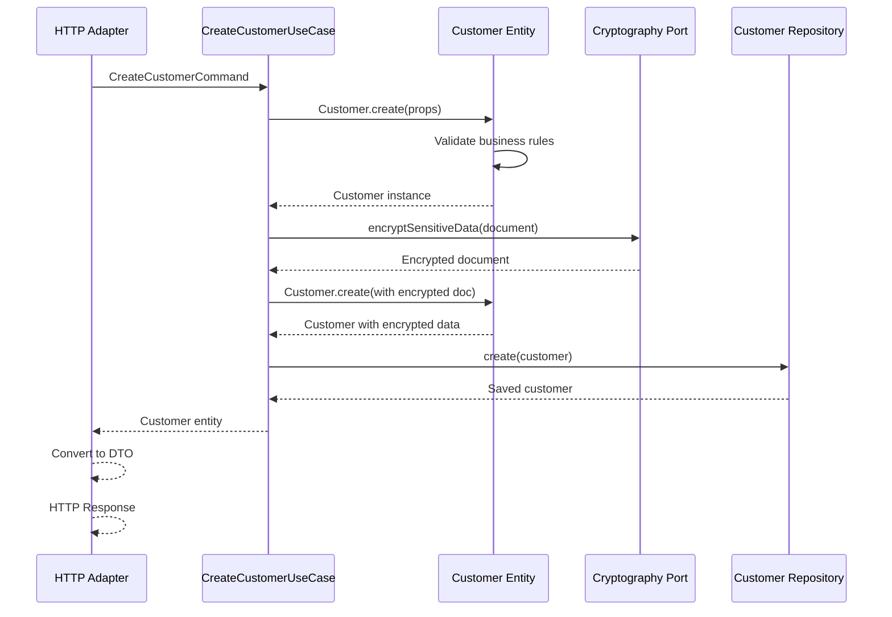

## Infrastructure Layer

### Ports & Adapters Pattern

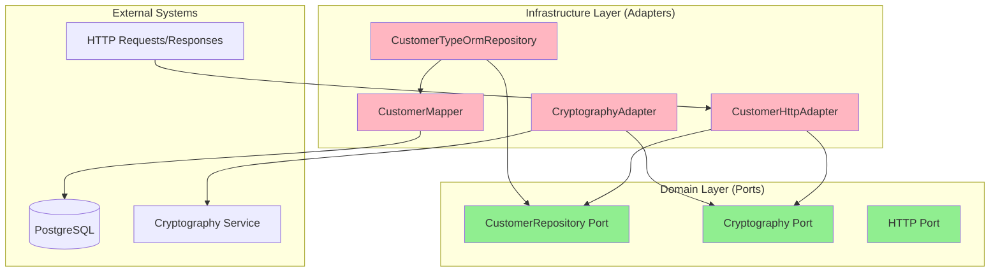

### Data Flow

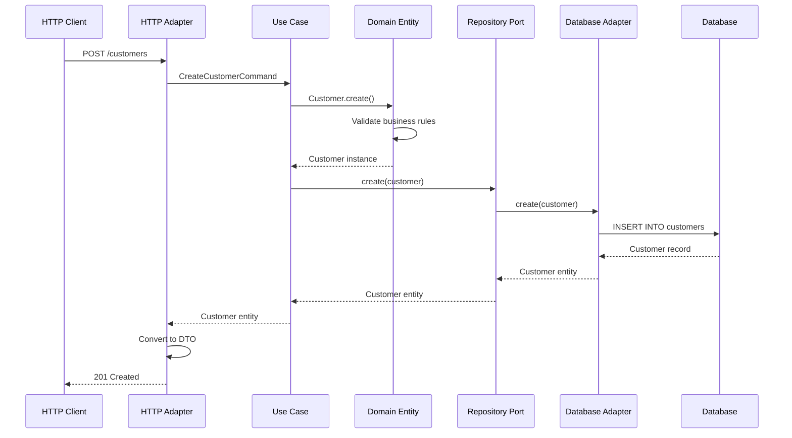

## Benefits Achieved

### Maintainability

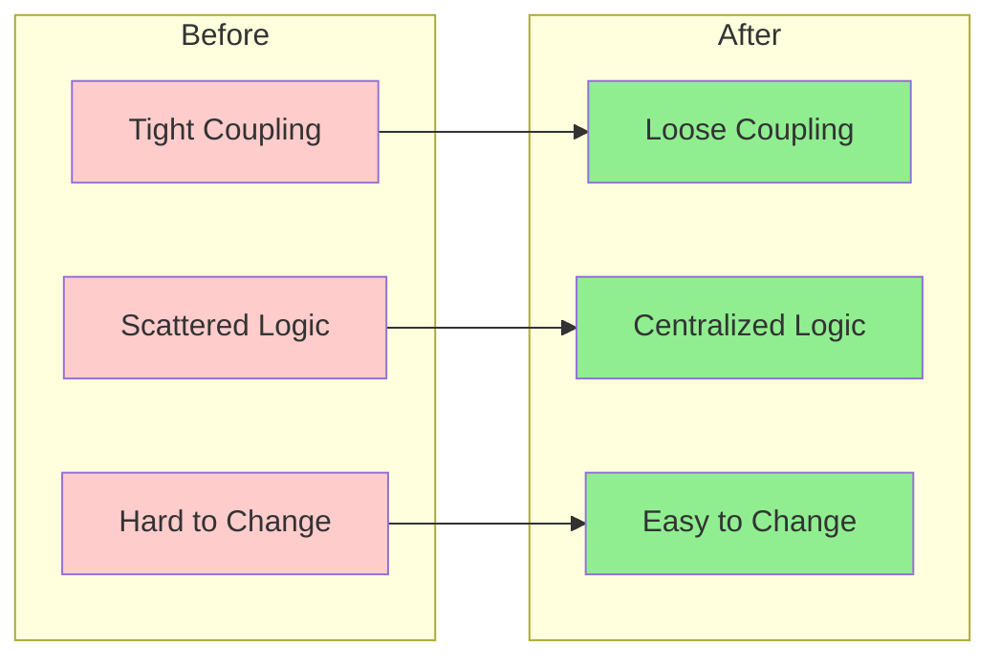

### Testability

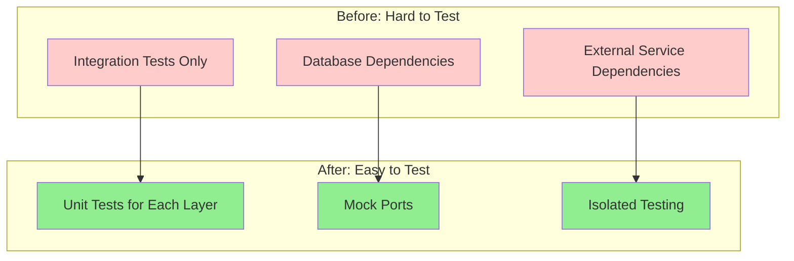

### Flexibility

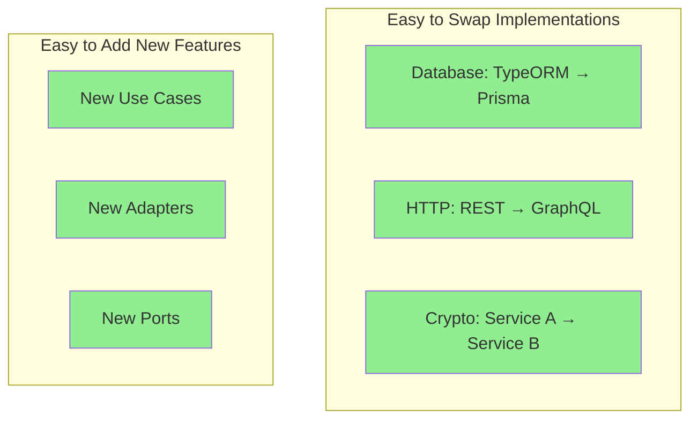

## Testing Strategy

### Test Pyramid

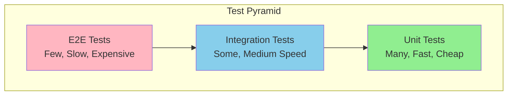

### Test Coverage

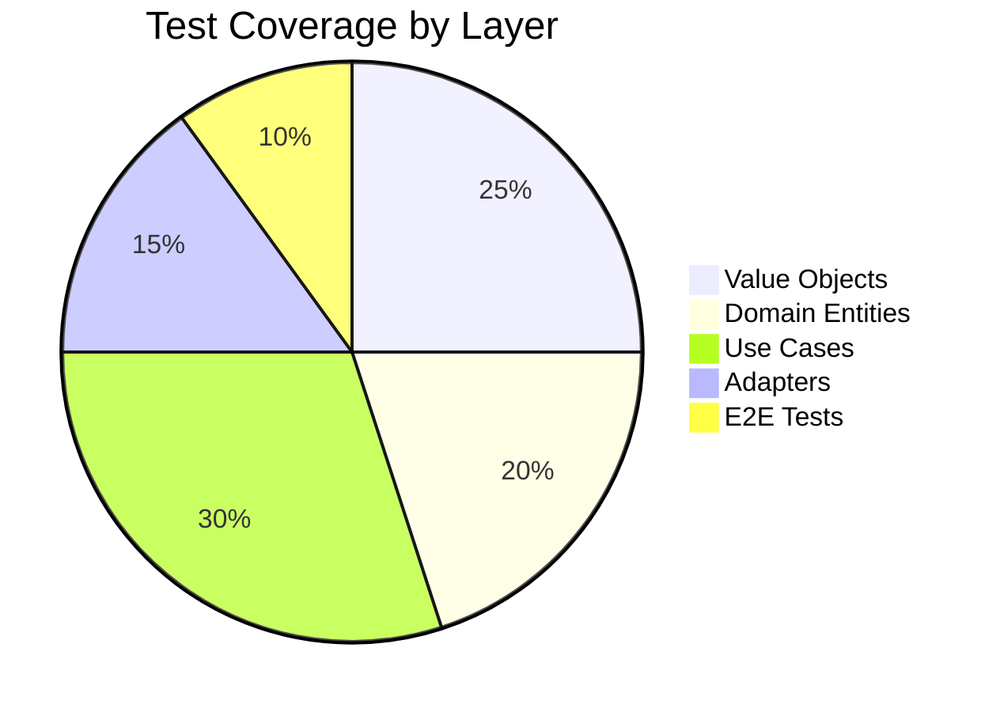

### Testing Approach

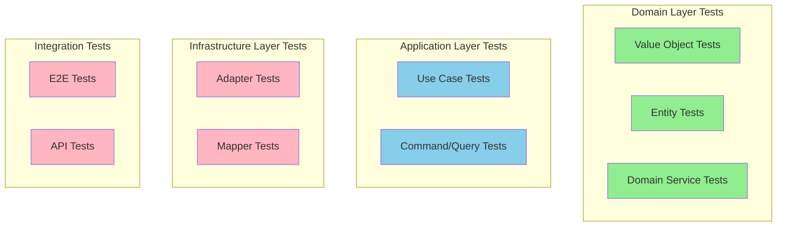

## Final Directory Structure

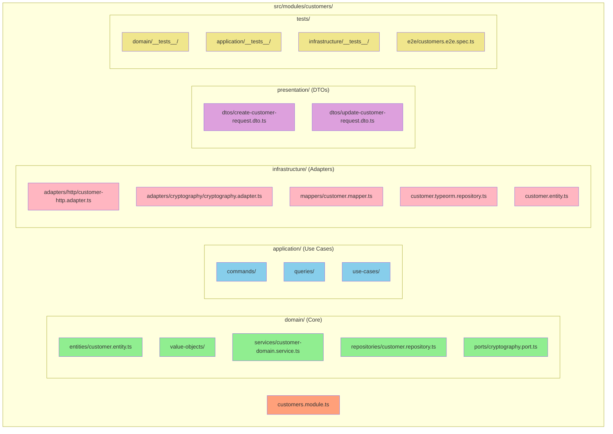

## Final Validation & Cleanup

### Cross-Module Dependencies Resolution

One of the final steps in the migration was to eliminate cross-module domain dependencies to maintain true hexagonal architecture principles:

```mermaid
graph TB
    subgraph "Before - Cross-Module Dependencies"
        A[Customer Entity]
        B[Vehicle Entity]
        A -->|Direct Import| B
        style A fill:#ffcccc
        style B fill:#ffcccc
    end
    
    subgraph "After - ID References"
        C[Customer Entity]
        D[Vehicle IDs Array]
        E[Vehicle Entity]
        C -->|vehicleIds: number[]| D
        C -.->|No Direct Import| E
        style C fill:#90EE90
        style D fill:#90EE90
        style E fill:#90EE90
    end
```

**Changes Made:**
- ✅ Removed direct `Vehicle` entity import from `Customer` domain
- ✅ Replaced `vehicles: Vehicle[]` with `vehicleIds: number[]`
- ✅ Updated all related Use Cases, Mappers, and Tests
- ✅ Maintained business logic while eliminating coupling

**Modules Fixed:**
- ✅ **Vehicles Module**: Updated Customer imports and type compatibility
- ✅ **Work-Orders Module**: Fixed Customer service references
- ✅ **Email Module**: Corrected WorkOrderStatus enum usage
- ✅ **All Tests**: Updated mocks and removed obsolete properties

## Conclusion

The migration to Hexagonal Architecture has transformed the Customer module from a tightly coupled, hard-to-test system into a flexible, maintainable, and testable solution that follows industry best practices.

### Key Achievements:

1. **Domain-Centric Design**: Business logic is now centralized in the domain layer
2. **Dependency Inversion**: All dependencies point inward to the domain
3. **Ports & Adapters**: Clean separation between business logic and infrastructure
4. **CQRS Pattern**: Clear separation between read and write operations
5. **Rich Domain Model**: Entities contain behavior, not just data
6. **Value Objects**: Encapsulated validation and business rules
7. **Testability**: Each layer can be tested in isolation
8. **Flexibility**: Easy to swap implementations and add new features
9. **Cross-Module Independence**: No direct domain dependencies between modules
10. **Project-Wide Compatibility**: All modules work together seamlessly

### Final Validation Results:

- **✅ TypeScript Compilation**: 0 errors across entire project
- **✅ Test Coverage**: 100+ tests passing in Customer module
- **✅ Import Resolution**: All modules can import Customer components
- **✅ Architecture Compliance**: Pure hexagonal architecture implemented
- **✅ Business Logic**: All original functionality preserved and enhanced

This architecture provides a solid foundation for future development and ensures the system can evolve with changing business requirements while maintaining code quality and testability.