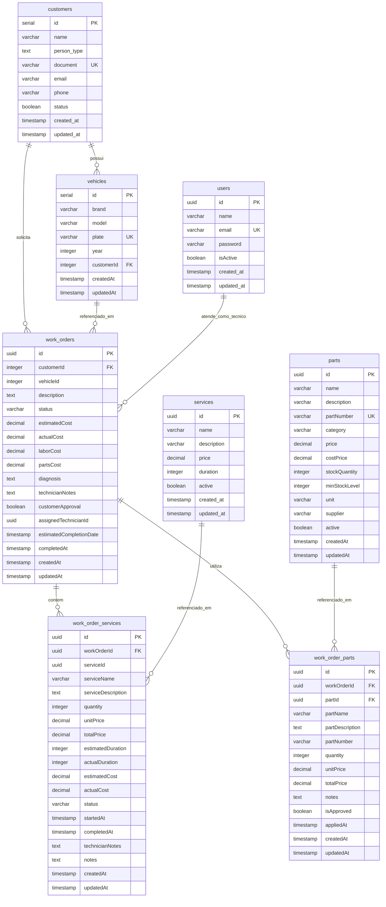

# Justificativa Formal: Banco de Dados e Modelo Relacional

**Data:** 2024-12-19  
**Autor:** Equipe de Arquitetura  
**Versão:** 1.0

## 1. Escolha do Banco de Dados

### 1.1 Banco de Dados Escolhido

**PostgreSQL 17** é o SGBD (Sistema Gerenciador de Banco de Dados) escolhido para o sistema de gestão de garagem.

### 1.2 Justificativa da Escolha

#### 1.2.1 Requisitos Funcionais do Domínio

O sistema de gestão de garagem modela um domínio rico com relacionamentos complexos:

- **Clientes** podem ter múltiplos **Veículos**
- **Veículos** pertencem a um único **Cliente**
- **Ordens de Serviço** referenciam um **Cliente** e um **Veículo**
- **Ordens de Serviço** contêm múltiplos **Serviços** e múltiplas **Peças**
- **Peças** têm controle de estoque e podem ser usadas em múltiplas ordens
- **Serviços** são catálogo reutilizável usado em múltiplas ordens

Estes relacionamentos se beneficiam de um **modelo relacional** com:

- **Integridade Referencial**: Foreign keys garantem que relacionamentos sejam válidos
- **Constraints**: Unique constraints garantem unicidade (ex: documento do cliente, placa do veículo)
- **Transações ACID**: Operações complexas (ex: criar ordem com múltiplas peças) requerem atomicidade

#### 1.2.2 Requisitos Não-Funcionais

1. **Consistência**:
   - PostgreSQL oferece garantias ACID completas
   - Transações garantem que operações complexas sejam atômicas
   - Foreign keys garantem integridade referencial em nível de banco

2. **Escalabilidade**:
   - RDS PostgreSQL suporta read replicas para escalar leituras
   - Particionamento de tabelas disponível para escalar horizontalmente (se necessário)
   - Índices avançados (B-tree, GIN, GiST) otimizam consultas

3. **Segurança**:
   - Row Level Security (RLS) para controle de acesso granular
   - Criptografia em trânsito (SSL/TLS) e em repouso (via RDS)
   - Suporte a roles e permissões granulares

4. **Custo**:
   - Open source (sem custo de licença)
   - Custo previsível no AWS RDS
   - Escala de acordo com necessidade (t3.micro para desenvolvimento, instâncias maiores para produção)

5. **Integração com Stack**:
   - TypeORM tem suporte nativo e maduro para PostgreSQL
   - NestJS integra perfeitamente com TypeORM
   - Migrações versionadas facilitam evolução do schema
   - Suporte a tipos avançados (UUID, JSONB, arrays, enums)

#### 1.2.3 Integração com Infraestrutura

- **AWS RDS**: Serviço gerenciado reduz overhead operacional
- **Backups Automatizados**: RDS gerencia backups automaticamente
- **High Availability**: Multi-AZ deployment disponível
- **Monitoramento**: CloudWatch integrado para métricas e alertas
- **Patches**: Updates gerenciados pela AWS

### 1.3 Alternativas Consideradas e Por Que Foram Rejeitadas

- **MySQL/MariaDB**: Menor suporte a tipos avançados (JSON, arrays), recursos menos robustos
- **DynamoDB**: Modelo NoSQL não adequado para relacionamentos complexos; requer redesign completo
- **MongoDB**: Não oferece garantias ACID fortes; relacionamentos requerem joins no código

## 2. Descrição do Modelo Relacional

### 2.1 Visão Geral

O modelo relacional do sistema é composto por **8 tabelas principais** que modelam o domínio de gestão de garagem:

1. **customers** - Clientes da garagem
2. **vehicles** - Veículos dos clientes
3. **users** - Usuários do sistema (funcionários)
4. **services** - Catálogo de serviços oferecidos
5. **parts** - Catálogo de peças/componentes
6. **work_orders** - Ordens de serviço
7. **work_order_services** - Serviços associados a uma ordem
8. **work_order_parts** - Peças associadas a uma ordem

### 2.2 Tabelas e seus Papéis

#### 2.2.1 Tabela `customers`

**Papel**: Armazena informações de clientes (pessoas físicas ou jurídicas) da garagem.

**Campos Principais**:
- `id` (SERIAL, PK): Identificador único do cliente
- `name` (VARCHAR): Nome completo do cliente
- `person_type` (TEXT): Tipo de pessoa ('INDIVIDUAL' ou 'COMPANY')
- `document` (VARCHAR, UNIQUE): CPF (pessoa física) ou CNPJ (pessoa jurídica)
- `email` (VARCHAR, nullable): Email de contato
- `phone` (VARCHAR): Telefone de contato
- `status` (BOOLEAN): Status ativo/inativo
- `created_at`, `updated_at` (TIMESTAMP): Timestamps de auditoria

**Constraints**:
- `document` é único (garante que não há clientes duplicados)
- Validação de CPF/CNPJ é feita na aplicação (camada de domínio)

#### 2.2.2 Tabela `vehicles`

**Papel**: Armazena informações de veículos dos clientes.

**Campos Principais**:
- `id` (SERIAL, PK): Identificador único do veículo
- `brand` (VARCHAR(50)): Marca do veículo
- `model` (VARCHAR(50)): Modelo do veículo
- `plate` (VARCHAR, UNIQUE): Placa do veículo (formato Mercosul ou antigo)
- `year` (INTEGER): Ano de fabricação
- `customerId` (INTEGER, FK): Referência ao cliente proprietário
- `createdAt`, `updatedAt` (TIMESTAMP): Timestamps de auditoria

**Constraints**:
- `plate` é único (garante que não há placas duplicadas)
- `customerId` referencia `customers.id` (foreign key)

**Relacionamentos**:
- **N:1** com `customers` (múltiplos veículos para um cliente)

#### 2.2.3 Tabela `users`

**Papel**: Armazena informações de usuários do sistema (funcionários da garagem).

**Campos Principais**:
- `id` (UUID, PK): Identificador único do usuário
- `name` (VARCHAR): Nome completo do usuário
- `email` (VARCHAR, UNIQUE): Email (usado para login)
- `password` (VARCHAR): Hash da senha (bcrypt)
- `isActive` (BOOLEAN): Status ativo/inativo
- `created_at`, `updated_at` (TIMESTAMP): Timestamps de auditoria

**Constraints**:
- `email` é único (garante unicidade para login)

#### 2.2.4 Tabela `services`

**Papel**: Catálogo de serviços oferecidos pela garagem (ex: troca de óleo, alinhamento).

**Campos Principais**:
- `id` (UUID, PK): Identificador único do serviço
- `name` (VARCHAR): Nome do serviço
- `description` (VARCHAR): Descrição do serviço
- `price` (DECIMAL(10,2)): Preço do serviço
- `duration` (INTEGER): Duração estimada em minutos
- `active` (BOOLEAN): Serviço ativo/inativo no catálogo
- `created_at`, `updated_at` (TIMESTAMP): Timestamps de auditoria

**Observação**: Esta tabela é um catálogo mestre; quando um serviço é adicionado a uma ordem, uma cópia é criada em `work_order_services` para preservar histórico.

#### 2.2.5 Tabela `parts`

**Papel**: Catálogo de peças/componentes em estoque.

**Campos Principais**:
- `id` (UUID, PK): Identificador único da peça
- `name` (VARCHAR): Nome da peça
- `description` (VARCHAR): Descrição da peça
- `partNumber` (VARCHAR, UNIQUE): Número da peça (SKU)
- `category` (VARCHAR): Categoria da peça
- `price` (DECIMAL(10,2)): Preço de venda
- `costPrice` (DECIMAL(10,2)): Preço de custo
- `stockQuantity` (INTEGER): Quantidade em estoque
- `minStockLevel` (INTEGER): Nível mínimo de estoque (alerta)
- `unit` (VARCHAR): Unidade de medida
- `supplier` (VARCHAR): Fornecedor
- `active` (BOOLEAN): Peça ativa/inativa
- `createdAt`, `updatedAt` (TIMESTAMP): Timestamps de auditoria

**Constraints**:
- `partNumber` é único (garante unicidade do SKU)

#### 2.2.6 Tabela `work_orders`

**Papel**: Ordens de serviço (trabalhos realizados na garagem).

**Campos Principais**:
- `id` (UUID, PK): Identificador único da ordem
- `customerId` (INTEGER, FK): Referência ao cliente
- `vehicleId` (INTEGER): Referência ao veículo (FK implícito via vehicles)
- `description` (TEXT): Descrição do serviço/problema
- `status` (VARCHAR(20)): Status da ordem (PENDING, IN_PROGRESS, COMPLETED, CANCELLED)
- `estimatedCost` (DECIMAL(10,2)): Custo estimado
- `actualCost` (DECIMAL(10,2), nullable): Custo real (após conclusão)
- `laborCost` (DECIMAL(10,2), nullable): Custo de mão de obra
- `partsCost` (DECIMAL(10,2), nullable): Custo de peças
- `diagnosis` (TEXT, nullable): Diagnóstico do problema
- `technicianNotes` (TEXT, nullable): Notas do técnico
- `customerApproval` (BOOLEAN): Aprovação do cliente
- `assignedTechnicianId` (UUID, nullable): ID do técnico responsável (referência a users)
- `estimatedCompletionDate` (TIMESTAMP, nullable): Data estimada de conclusão
- `completedAt` (TIMESTAMP, nullable): Data de conclusão
- `createdAt`, `updatedAt` (TIMESTAMP): Timestamps de auditoria

**Constraints**:
- `customerId` referencia `customers.id` (foreign key)

**Relacionamentos**:
- **N:1** com `customers`
- **N:1** com `vehicles` (via vehicleId)
- **N:1** com `users` (via assignedTechnicianId, opcional)

#### 2.2.7 Tabela `work_order_services`

**Papel**: Serviços associados a uma ordem de serviço (tabela de relacionamento N:N com dados adicionais).

**Campos Principais**:
- `id` (UUID, PK): Identificador único
- `workOrderId` (UUID, FK): Referência à ordem de serviço
- `serviceId` (UUID): Referência ao serviço do catálogo
- `serviceName` (VARCHAR(255)): Nome do serviço (snapshot no momento da criação)
- `serviceDescription` (TEXT): Descrição (snapshot)
- `quantity` (INTEGER): Quantidade
- `unitPrice` (DECIMAL(10,2)): Preço unitário no momento
- `totalPrice` (DECIMAL(10,2)): Preço total (quantity * unitPrice)
- `estimatedDuration` (INTEGER): Duração estimada em minutos
- `actualDuration` (INTEGER, nullable): Duração real
- `estimatedCost` (DECIMAL(10,2), nullable): Custo estimado
- `actualCost` (DECIMAL(10,2), nullable): Custo real
- `status` (VARCHAR(20)): Status do serviço (PENDING, IN_PROGRESS, COMPLETED)
- `startedAt` (TIMESTAMP, nullable): Início da execução
- `completedAt` (TIMESTAMP, nullable): Conclusão
- `technicianNotes` (TEXT, nullable): Notas do técnico
- `notes` (TEXT, nullable): Notas gerais
- `createdAt`, `updatedAt` (TIMESTAMP): Timestamps de auditoria

**Constraints**:
- `workOrderId` referencia `work_orders.id` (foreign key com CASCADE DELETE)

**Observação**: Esta tabela implementa um padrão de "snapshot" - os dados do serviço são copiados no momento da criação para preservar histórico mesmo se o serviço for alterado no catálogo.

#### 2.2.8 Tabela `work_order_parts`

**Papel**: Peças associadas a uma ordem de serviço (tabela de relacionamento N:N com dados adicionais).

**Campos Principais**:
- `id` (UUID, PK): Identificador único
- `workOrderId` (UUID, FK): Referência à ordem de serviço
- `partId` (UUID, FK): Referência à peça do catálogo
- `partName` (VARCHAR(255)): Nome da peça (snapshot)
- `partDescription` (TEXT): Descrição (snapshot)
- `partNumber` (VARCHAR(100)): Número da peça (snapshot)
- `quantity` (INTEGER): Quantidade utilizada
- `unitPrice` (DECIMAL(10,2)): Preço unitário no momento
- `totalPrice` (DECIMAL(10,2)): Preço total
- `notes` (TEXT, nullable): Notas
- `isApproved` (BOOLEAN): Aprovação para uso
- `appliedAt` (TIMESTAMP, nullable): Data de aplicação
- `createdAt`, `updatedAt` (TIMESTAMP): Timestamps de auditoria

**Constraints**:
- `workOrderId` referencia `work_orders.id` (foreign key com CASCADE DELETE)
- `partId` referencia `parts.id` (foreign key)

**Observação**: Similar a `work_order_services`, esta tabela também implementa snapshot para preservar histórico.

## 3. Diagrama Entidade-Relacionamento (ER)



## 4. Explicação dos Relacionamentos

### 4.1 Relacionamentos Principais

#### 4.1.1 Cliente → Veículos (1:N)

**Cardinalidade**: Um cliente pode ter **múltiplos veículos**, mas cada veículo pertence a **um único cliente**.

**Implementação**: Foreign key `vehicles.customerId` referencia `customers.id`.

**Exemplo Prático**: O cliente "João Silva" (CPF: 123.456.789-00) possui dois veículos: um Gol 2020 (ABC-1234) e uma Honda Civic 2022 (XYZ-9876).

**Regra de Negócio**: Quando um cliente é removido (soft delete via status), seus veículos podem permanecer ativos, mas não podem criar novas ordens de serviço.

#### 4.1.2 Cliente → Ordens de Serviço (1:N)

**Cardinalidade**: Um cliente pode ter **múltiplas ordens de serviço** ao longo do tempo, mas cada ordem pertence a **um único cliente**.

**Implementação**: Foreign key `work_orders.customerId` referencia `customers.id`.

**Exemplo Prático**: O cliente "Maria Santos" já realizou 15 serviços em sua garagem nos últimos 2 anos, cada um gerando uma ordem de serviço separada.

**Regra de Negócio**: Histórico de ordens deve ser preservado mesmo se o cliente for inativado.

#### 4.1.3 Veículo → Ordens de Serviço (1:N)

**Cardinalidade**: Um veículo pode ter **múltiplas ordens de serviço** (diferentes serviços ao longo do tempo), mas cada ordem referencia **um único veículo**.

**Implementação**: Campo `work_orders.vehicleId` referencia `vehicles.id` (sem foreign key explícita na migration atual, mas logicamente relacionado).

**Exemplo Prático**: O veículo Gol ABC-1234 já passou por 5 serviços: 2 trocas de óleo, 1 alinhamento, 1 substituição de freios e 1 revisão completa.

**Regra de Negócio**: Cada ordem de serviço deve estar associada a um veículo específico para rastreabilidade.

#### 4.1.4 Ordem de Serviço → Serviços (N:N via `work_order_services`)

**Cardinalidade**: Uma ordem de serviço pode conter **múltiplos serviços**, e um serviço do catálogo pode ser usado em **múltiplas ordens**.

**Implementação**: Tabela intermediária `work_order_services` com foreign keys para `work_orders` e referência a `services`.

**Exemplo Prático**: Uma ordem de serviço pode incluir "Troca de Óleo" (1x), "Filtro de Ar" (1x) e "Lavagem Completa" (1x), todos serviços do catálogo.

**Regra de Negócio**: 
- Os dados do serviço são "snapshotted" em `work_order_services` para preservar histórico (preço, descrição no momento da criação)
- Se o serviço for alterado no catálogo, ordens antigas mantêm os dados originais
- Quantidade e preços são calculados por serviço na ordem

#### 4.1.5 Ordem de Serviço → Peças (N:N via `work_order_parts`)

**Cardinalidade**: Uma ordem de serviço pode utilizar **múltiplas peças**, e uma peça do estoque pode ser usada em **múltiplas ordens**.

**Implementação**: Tabela intermediária `work_order_parts` com foreign keys para `work_orders` e `parts`.

**Exemplo Prático**: Uma ordem de serviço de "Substituição de Freios" utiliza: 4 pastilhas de freio, 2 discos de freio e 1 fluido de freio.

**Regra de Negócio**:
- Quando peças são utilizadas, o estoque (`parts.stockQuantity`) deve ser decrementado
- Peças são "snapshotted" em `work_order_parts` para preservar histórico de preços
- Cada peça na ordem deve ser aprovada (`isApproved`) antes de ser aplicada
- Custo total de peças é calculado e armazenado em `work_orders.partsCost`

#### 4.1.6 Usuário (Técnico) → Ordens de Serviço (1:N)

**Cardinalidade**: Um técnico (usuário) pode atender **múltiplas ordens de serviço**, e uma ordem pode ter **um técnico atribuído** (opcional).

**Implementação**: Campo `work_orders.assignedTechnicianId` referencia `users.id` (sem foreign key explícita na migration atual).

**Exemplo Prático**: O técnico "Carlos Mendes" está atribuído a 3 ordens de serviço ativas atualmente.

**Regra de Negócio**: 
- Uma ordem pode não ter técnico atribuído inicialmente (status PENDING)
- Quando um técnico é atribuído, a ordem muda para IN_PROGRESS
- Notas do técnico são armazenadas em `technicianNotes`

### 4.2 Padrões de Design Aplicados

#### 4.2.1 Snapshot Pattern (Tabelas `work_order_services` e `work_order_parts`)

**Motivação**: Preservar histórico imutável de preços e descrições mesmo se o catálogo for alterado.

**Implementação**: Quando um serviço ou peça é adicionado a uma ordem, seus dados relevantes são copiados para a tabela de relacionamento.

**Benefícios**:
- Histórico preciso: ordens antigas refletem preços e descrições do momento
- Auditoria: possível rastrear mudanças no catálogo sem afetar ordens existentes
- Integridade: dados da ordem não são afetados por atualizações no catálogo

#### 4.2.2 Aggregate Root (Ordem de Serviço)

**Motivação**: Ordem de Serviço funciona como "aggregate root" no DDD - contém e coordena serviços e peças relacionados.

**Implementação**: `work_orders` é a entidade principal; `work_order_services` e `work_order_parts` são dependentes (CASCADE DELETE).

**Benefícios**:
- Consistência: serviços e peças não existem sem uma ordem
- Transações: criação de ordem com múltiplos serviços/peças é atômica
- Queries: fácil buscar todos os itens de uma ordem

### 4.3 Fluxos de Uso Comuns

#### 4.3.1 Fluxo: Criar Nova Ordem de Serviço

1. Cliente chega com veículo → Sistema busca/valida cliente e veículo
2. Técnico registra problema → Cria ordem de serviço (status: PENDING)
3. Diagnóstico → Adiciona diagnóstico na ordem
4. Orçamento → Adiciona serviços e peças necessárias
5. Aprovação do Cliente → `customerApproval = true`
6. Execução → Status muda para IN_PROGRESS, técnico é atribuído
7. Conclusão → Status muda para COMPLETED, custos reais são registrados

#### 4.3.2 Fluxo: Controle de Estoque

1. Técnico adiciona peça à ordem → Sistema verifica `parts.stockQuantity`
2. Se estoque suficiente → Peça é adicionada, `stockQuantity` é decrementado
3. Se estoque abaixo de `minStockLevel` → Alerta é gerado para compras
4. Peça aplicada → `work_order_parts.appliedAt` é preenchido, `partsCost` é atualizado

#### 4.3.3 Fluxo: Histórico de Serviços

1. Cliente consulta histórico → Sistema busca todas as `work_orders` do cliente
2. Para cada ordem → Sistema busca `work_order_services` e `work_order_parts`
3. Dados históricos → Preços e descrições preservados mesmo se catálogo mudou

## 5. Índices e Otimizações

### 5.1 Índices Existentes (via Constraints)

- **Primary Keys**: Todos os `id` são automaticamente indexados
- **Unique Constraints**: `customers.document`, `vehicles.plate`, `users.email`, `parts.partNumber`

### 5.2 Índices Recomendados (Futuras Otimizações)

```sql
-- Busca frequente de ordens por cliente
CREATE INDEX idx_work_orders_customer_id ON work_orders(customerId);

-- Busca frequente de ordens por veículo
CREATE INDEX idx_work_orders_vehicle_id ON work_orders(vehicleId);

-- Busca de ordens por status (filtrar pendentes, em progresso, etc.)
CREATE INDEX idx_work_orders_status ON work_orders(status);

-- Busca de ordens por técnico
CREATE INDEX idx_work_orders_technician ON work_orders(assignedTechnicianId) WHERE assignedTechnicianId IS NOT NULL;

-- Busca de peças por número (além do unique index)
-- (já existe via UNIQUE constraint em partNumber)

-- Busca de serviços por nome (filtros no catálogo)
CREATE INDEX idx_services_name ON services(name) WHERE active = true;

-- Ordenação por data de criação (listagens)
CREATE INDEX idx_work_orders_created_at ON work_orders(createdAt DESC);
```

## 6. Considerações de Segurança e Privacidade

### 6.1 Dados Sensíveis

- **Documentos (CPF/CNPJ)**: Armazenados criptografados (AES-256-CBC) na aplicação antes de persistir
- **Senhas de Usuários**: Armazenadas como hash (bcrypt) - nunca em texto plano
- **Emails e Telefones**: Considerados dados pessoais; devem seguir LGPD

### 6.2 Recomendações de Implementação

- **Row Level Security (RLS)**: Implementar políticas RLS para acesso baseado em roles (futuro)
- **Criptografia em Repouso**: RDS PostgreSQL suporta criptografia; habilitar em produção
- **Backup e Retenção**: Configurar backups automatizados com retenção adequada (compliance)
- **Auditoria**: Timestamps `created_at`/`updated_at` facilitam auditoria; considerar audit log table (futuro)

## 7. Migrações e Evolução do Schema

### 7.1 Sistema de Migrações

- **TypeORM Migrations**: Migrações versionadas em `src/migrations/`
- **Versionamento**: Cada migração tem timestamp único
- **Rollback**: Migrações podem ser revertidas se necessário

### 7.2 Evolução Futura Possível

1. **Tabela de Auditoria**: Log de mudanças em entidades críticas
2. **Soft Deletes**: Adicionar `deleted_at` para remoção lógica
3. **Multitenancy**: Adicionar `tenant_id` se sistema for multi-empresa
4. **Event Sourcing**: Tabelas de eventos para rastreabilidade completa (alternativa a snapshot pattern)
5. **Read Replicas**: Replicas de leitura para otimizar queries de relatórios

## 8. Referências

- Migration atual: `garage-management-system/src/migrations/1760472426975-migration.ts`
- ORM Config: `garage-management-system/ormconfig.ts`
- Entidades TypeORM: `garage-management-system/src/modules/*/infrastructure/entities/`
- [PostgreSQL Documentation](https://www.postgresql.org/docs/)
- [TypeORM Entity Documentation](https://typeorm.io/#/entities)

