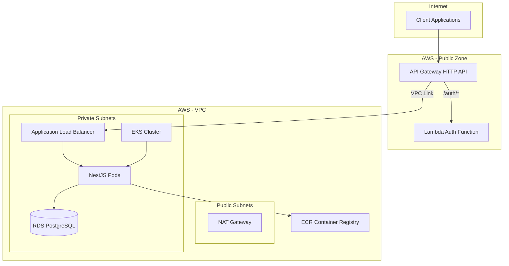

# RFC-002: Escolha da Nuvem e Estratégia de Deploy

**Status:** Accepted  
**Data:** 2024-12-19  
**Autores:** Equipe de Arquitetura

## Contexto

O sistema de gestão de garagem necessita de uma infraestrutura cloud que suporte:

- Aplicação NestJS containerizada
- Banco de dados PostgreSQL gerenciado
- Autenticação serverless (Lambda)
- Escalabilidade automática
- Alta disponibilidade
- Segurança e isolamento de rede
- Integração com serviços gerenciados

A escolha da nuvem e estratégia de deploy impacta diretamente custos, manutenibilidade, escalabilidade e segurança do sistema.

## Alternativas Consideradas

### 1. AWS (Escolhido)

**Prós:**
- Ecossistema completo de serviços gerenciados
- EKS (Kubernetes gerenciado) para orquestração
- RDS para PostgreSQL gerenciado
- Lambda para funções serverless
- API Gateway para roteamento
- VPC para isolamento de rede
- Integração entre serviços (VPC Link, Security Groups)
- Terraform tem suporte maduro para AWS
- Escalabilidade e alta disponibilidade nativas
- CloudWatch para monitoramento
- IAM para controle de acesso granular

**Contras:**
- Pode ter curva de aprendizado inicial
- Custos podem escalar se não monitorados
- Lock-in parcial com serviços AWS (mitigável via abstrações)

### 2. Google Cloud Platform (GCP)

**Prós:**
- GKE para Kubernetes
- Cloud SQL para PostgreSQL
- Cloud Functions/Cloud Run para serverless
- Boa integração entre serviços

**Contras:**
- Menor adoção no mercado brasileiro
- Menos conhecimento do time no ecossistema GCP
- Terraform funciona bem, mas menos exemplos/templates

### 3. Microsoft Azure

**Prós:**
- Azure Kubernetes Service (AKS)
- Azure Database for PostgreSQL
- Azure Functions
- Integração com ferramentas Microsoft

**Contras:**
- Menor familiaridade do time
- Custo pode ser alto
- Documentação e comunidade menores para o stack escolhido

### 4. On-Premise / Self-Hosted

**Prós:**
- Controle total sobre infraestrutura
- Sem dependência de fornecedor
- Potencialmente menor custo em longo prazo (para grandes volumes)

**Contras:**
- Requer equipe dedicada de infraestrutura
- Não oferece escalabilidade automática nativa
- Alto custo inicial de setup e manutenção
- Responsabilidade por segurança, backups, updates
- Não se alinha com o objetivo de foco em desenvolvimento de software

## Decisão

**AWS será utilizada como plataforma cloud principal, com a seguinte arquitetura:**

1. **Orquestração**: Amazon EKS (Elastic Kubernetes Service) para containers da aplicação principal
2. **Banco de Dados**: Amazon RDS for PostgreSQL
3. **Autenticação**: AWS Lambda (serverless) via API Gateway
4. **Roteamento**: API Gateway (HTTP API) com VPC Link para EKS
5. **Rede**: VPC com subnets públicas e privadas
6. **Container Registry**: Amazon ECR
7. **Infraestrutura como Código**: Terraform

## Racional

1. **Ecosistema Completo**: AWS oferece todos os serviços necessários de forma integrada:
   - EKS para Kubernetes (já amplamente usado pela equipe)
   - RDS para banco gerenciado (menos operacional overhead)
   - Lambda para autenticação serverless (custo efetivo, escala automática)

2. **Segurança e Isolamento**:
   - VPC permite isolamento completo de rede
   - Security Groups controlam tráfego entre componentes
   - IAM para controle de acesso granular
   - RDS em subnets privadas (isolado da internet pública)

3. **Escalabilidade**:
   - EKS com Auto Scaling de nodes
   - HPA (Horizontal Pod Autoscaler) para escalar pods baseado em CPU/memória
   - RDS com opção de read replicas para escalar leituras
   - Lambda escala automaticamente conforme demanda

4. **Alta Disponibilidade**:
   - Multi-AZ deployment no RDS
   - EKS nodes em múltiplas Availability Zones
   - Load Balancer interno (ALB) distribui tráfego

5. **IaC com Terraform**:
   - Terraform tem excelente suporte para AWS
   - Módulos reutilizáveis facilitam manutenção
   - Estado remoto no S3 com locking no DynamoDB
   - Versionamento de infraestrutura via Git

6. **Custo-Efetividade**:
   - Pay-as-you-go model
   - Instâncias reservadas disponíveis para RDS/EKS
   - Lambda cobra apenas por execução (ideal para autenticação)
   - Sem custo de infraestrutura ociosa

7. **Monitoramento e Observabilidade**:
   - CloudWatch integrado para métricas e logs
   - Integração com New Relic (já configurado no código)
   - Alertas e dashboards configuráveis

## Impacto

### Impactos Positivos

- **Operação Simplificada**: Serviços gerenciados reduzem overhead operacional
- **Escalabilidade Automática**: Sistema escala conforme demanda sem intervenção manual
- **Segurança Robusta**: Múltiplas camadas de segurança (VPC, Security Groups, IAM)
- **Alta Disponibilidade**: Arquitetura multi-AZ garante resiliência
- **Deploy Facilitado**: CI/CD pode integrar diretamente com AWS (GitHub Actions → ECR → EKS)

### Impactos Negativos e Mitigações

- **Vendor Lock-in**: Dependência de serviços AWS específicos
  - **Mitigação**: Usar abstrações onde possível (Kubernetes abstrai EKS), código da aplicação é portable
- **Custos Potenciais**: Custos podem escalar se não monitorados
  - **Mitigação**: Configurar budgets e alertas CloudWatch; usar instâncias reservadas; otimizar recursos
- **Complexidade Inicial**: Setup inicial requer conhecimento de múltiplos serviços AWS
  - **Mitigação**: Documentação detalhada e IaC facilitam replicação; time já possui conhecimento

## Arquitetura Implementada

## Plano de Implementação

1. ✅ **Backend Terraform**: S3 bucket e DynamoDB para state remoto (implementado)
2. ✅ **Infraestrutura Base**: VPC, subnets, security groups (implementado)
3. ✅ **EKS Cluster**: Cluster Kubernetes gerenciado (implementado)
4. ✅ **RDS PostgreSQL**: Instância de banco de dados (implementado)
5. ✅ **API Gateway**: Roteamento HTTP API (implementado)
6. ✅ **Lambda Auth**: Função serverless para autenticação (implementado)
7. ⚠️ **CI/CD**: GitHub Actions para deploy automatizado (parcialmente implementado)
8. ⚠️ **Monitoramento**: Dashboards CloudWatch e alertas (pendente configuração completa)
9. ⚠️ **Produção Hardening**: Remover `publicly_accessible` do RDS, habilitar Multi-AZ (pendente)

## Referências

- [AWS EKS Documentation](https://docs.aws.amazon.com/eks/)
- [AWS RDS for PostgreSQL](https://aws.amazon.com/rds/postgresql/)
- [Terraform AWS Provider](https://registry.terraform.io/providers/hashicorp/aws/latest/docs)
- Infraestrutura como Código: `garage-management-infra/`
- Banco de Dados IaC: `garage-management-database/`

