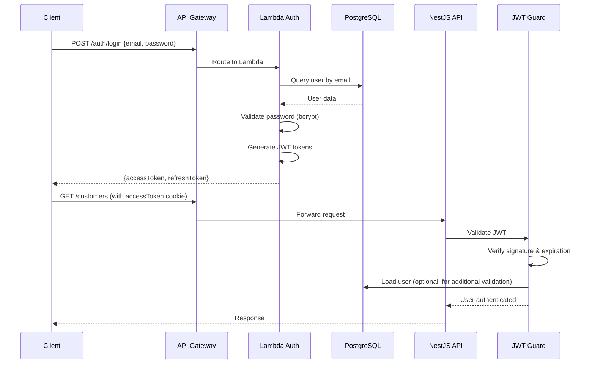

# RFC-003: Estratégia de Autenticação e Autorização

**Status:** Accepted  
**Data:** 2024-12-19  
**Autores:** Equipe de Arquitetura

## Contexto

O sistema de gestão de garagem precisa de um mecanismo seguro de autenticação e autorização para:

- Proteger endpoints da API principal
- Gerenciar sessões de usuários (funcionários da garagem)
- Autenticar clientes quando necessário
- Escalar conforme demanda (picos de acesso)
- Minimizar latência em operações autenticadas
- Suportar diferentes tipos de usuários (técnicos, atendentes, gerentes)

A estratégia escolhida impacta segurança, performance, escalabilidade e experiência do usuário.

## Alternativas Consideradas

### 1. JWT Stateless Authentication (Escolhido)

**Prós:**
- Stateless: não requer armazenamento de sessão no servidor
- Escalabilidade: qualquer instância pode validar tokens sem compartilhar estado
- Performance: validação rápida via assinatura digital
- Microserviços-friendly: tokens podem ser validados independentemente
- Suporte a refresh tokens para melhor segurança
- Padrão da indústria (amplamente adotado)
- Compatível com arquitetura serverless (Lambda)

**Contras:**
- Tokens não podem ser revogados facilmente antes do vencimento (mitigável com blacklist ou refresh tokens curtos)
- Tamanho do token pode aumentar payload de requisições

### 2. Session-Based Authentication

**Prós:**
- Revogação imediata possível (remover sessão do storage)
- Controle fino sobre sessões ativas

**Contras:**
- Requer storage compartilhado (Redis, banco de dados) para múltiplas instâncias
- Overhead de I/O para cada requisição
- Não ideal para arquitetura serverless
- Complexidade adicional de gerenciamento de sessões
- Escalabilidade limitada

### 3. OAuth 2.0 / OpenID Connect (Externo)

**Prós:**
- Delegar autenticação a provedor externo (Google, Auth0, AWS Cognito)
- Reduz complexidade de gerenciamento de credenciais
- Suporte a SSO (Single Sign-On)

**Contras:**
- Dependência de serviço externo
- Custos adicionais (para serviços comerciais)
- Complexidade de integração
- Overhead para sistemas internos simples
- Menos controle sobre fluxo de autenticação

### 4. AWS Cognito

**Prós:**
- Totalmente gerenciado pela AWS
- Integração nativa com outros serviços AWS
- Escalabilidade automática
- Suporte a múltiplos provedores de identidade

**Contras:**
- Vendor lock-in com AWS
- Custo adicional
- Pode ser overkill para necessidades atuais
- Menor flexibilidade para customizações específicas

## Decisão

**JWT (JSON Web Token) stateless authentication será utilizada, com a seguinte arquitetura:**

1. **Autenticação**: Endpoint `/auth/login` valida credenciais e emite tokens JWT
2. **Access Token**: Token de curta duração (15 minutos) para requisições API
3. **Refresh Token**: Token de longa duração (7 dias) para renovar access tokens
4. **Validação**: JWT Strategy do Passport.js valida tokens em requisições protegidas
5. **Armazenamento**: Access tokens em cookies HTTP-only para segurança
6. **Implementação Híbrida**:
   - **Lambda Serverless** (`garage-management-auth`): Endpoint de autenticação serverless
   - **NestJS Application** (`garage-management-system`): Validação de tokens e guards

## Racional

1. **Arquitetura Stateless**:
   - Alinha com arquitetura de microserviços e Kubernetes
   - Permite escalar horizontalmente sem compartilhar estado
   - Cada pod do EKS pode validar tokens independentemente

2. **Segurança**:
   - Tokens assinados digitalmente (impossível falsificar sem secret)
   - Access tokens de curta duração reduzem janela de ataque
   - Refresh tokens permitem renovação sem reautenticação
   - Cookies HTTP-only previnem acesso via JavaScript (XSS protection)

3. **Performance**:
   - Validação local (sem consulta a banco/Redis)
   - Reduz latência em requisições autenticadas
   - Ideal para APIs de alta performance

4. **Escalabilidade**:
   - Lambda escala automaticamente para picos de login
   - Validação de tokens não cria gargalo
   - Não requer storage compartilhado para validação

5. **Compatibilidade com Stack**:
   - Passport.js e `@nestjs/passport` oferecem suporte nativo
   - JWT é padrão amplamente suportado
   - Funciona bem com NestJS Guards

6. **Flexibilidade**:
   - Tokens podem conter claims customizados (roles, permissions)
   - Fácil adicionar novos tipos de usuários no futuro
   - Suporta diferentes estratégias de autorização

## Implementação Atual

### Arquitetura de Autenticação

### Componentes

1. **Lambda Auth Service** (`garage-management-auth`):
   - Endpoint `/login`: Valida credenciais e emite tokens
   - Endpoint `/register`: Cria novos usuários (se necessário)
   - Usa PostgreSQL para armazenar usuários
   - Bcrypt para hash de senhas

2. **NestJS Auth Module** (`garage-management-system/src/modules/auth`):
   - `JwtStrategy`: Valida tokens JWT
   - `JwtAuthGuard`: Protege rotas
   - `AuthService`: Gerencia tokens (refresh, validação)
   - Integração com Users module

3. **Token Configuration**:
   - Access Token: 15 minutos (900s)
   - Refresh Token: 7 dias
   - Secrets configuráveis via environment variables

4. **Notificações por Email**:
   - **Provedor**: Brevo (anteriormente Sendinblue)
   - **Adapter**: `BrevoAdapter` implementa port de email
   - **Templates**: Handlebars para templates HTML
   - **Variável de Ambiente**: `BREVO_API_KEY` necessária
   - **Uso**: Notificações de mudança de status de ordens de serviço

## Impacto

### Impactos Positivos

- **Segurança**: Tokens assinados e curtos reduzem riscos
- **Performance**: Validação rápida sem I/O adicional
- **Escalabilidade**: Stateless permite escala horizontal ilimitada
- **Manutenibilidade**: Padrão amplamente conhecido facilita manutenção
- **Flexibilidade**: Fácil adicionar claims e roles no futuro

### Impactos Negativos e Mitigações

- **Revogação de Tokens**: Tokens válidos não podem ser revogados antes do vencimento
  - **Mitigação**: Access tokens curtos (15 min) limitam janela de exposição; considerar blacklist em Redis se necessário
- **Tamanho do Token**: JWT adiciona bytes ao header de requisições
  - **Mitigação**: Impacto mínimo para APIs REST; tokens são pequenos (~200-500 bytes)
- **Segredo Compartilhado**: Secret JWT deve ser compartilhado entre serviços
  - **Mitigação**: Usar AWS Secrets Manager ou Parameter Store; rotacionar secrets periodicamente
- **Refresh Token Storage**: Refresh tokens atualmente em memória (não persistente)
  - **Mitigação**: Considerar storage em banco de dados ou Redis para produção; implementar limpeza de tokens expirados

## Melhorias Futuras

1. **Token Blacklist**: Implementar blacklist em Redis para revogação imediata
2. **Multi-Factor Authentication (MFA)**: Adicionar 2FA para maior segurança
3. **OAuth Integration**: Permitir login via Google/Auth0 como opção
4. **Role-Based Access Control (RBAC)**: Implementar permissões granulares via claims JWT
5. **Refresh Token Persistence**: Persistir refresh tokens em banco para melhor gestão
6. **Token Rotation**: Implementar rotação automática de refresh tokens

## Referências

- [JWT.io](https://jwt.io/)
- [Passport.js JWT Strategy](http://www.passportjs.org/packages/passport-jwt/)
- [NestJS Authentication](https://docs.nestjs.com/security/authentication)
- [Brevo API Documentation](https://developers.brevo.com/)
- Código Lambda Auth: `garage-management-auth/`
- Código NestJS Auth: `garage-management-system/src/modules/auth/`
- Código Email Module: `garage-management-system/src/modules/email/`

