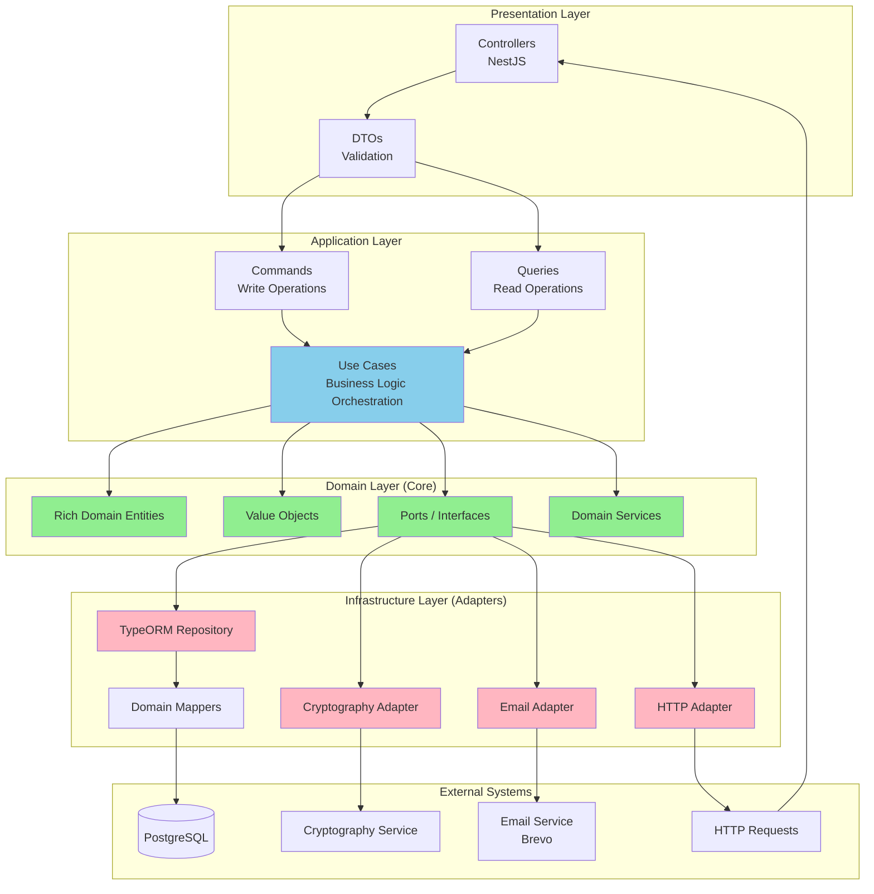
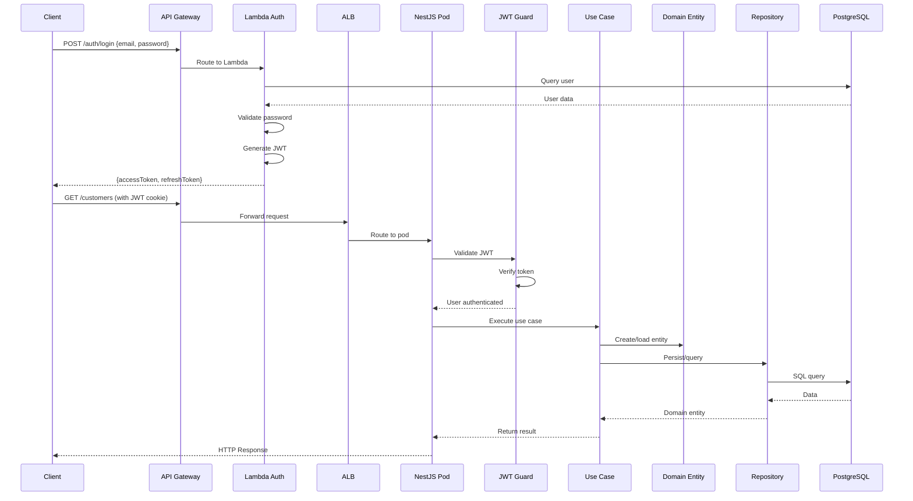

# Visão Geral da Arquitetura - Garage Management System

**Data:** 2024-12-19  
**Versão:** 1.0

## Resumo Executivo

O **Garage Management System** é um sistema de gestão de garagem/oficina mecânica desenvolvido com arquitetura moderna, seguindo princípios de **Clean Architecture**, **Domain-Driven Design (DDD)** e **Hexagonal Architecture (Ports & Adapters)**.

O sistema é composto por **4 projetos principais** que trabalham em conjunto:

1. **garage-management-system**: Aplicação principal NestJS (monolito modular)
2. **garage-management-auth**: Serviço de autenticação serverless (AWS Lambda)
3. **garage-management-infra**: Infraestrutura como código (Terraform)
4. **garage-management-database**: Provisionamento do banco de dados RDS (Terraform)

## Arquitetura de Alto Nível

```mermaid
graph TB
    subgraph "Clientes"
        Web[Web Application]
        Mobile[Mobile App]
        API_Client[API Clients]
    end
    
    subgraph "AWS - Internet-Facing"
        APIGW[API Gateway HTTP API]
    end
    
    subgraph "AWS - Serverless"
        Lambda[Lambda Auth Function]
    end
    
    subgraph "AWS - VPC"
        subgraph "Public Subnets"
            NAT[NAT Gateway]
        end
        
        subgraph "Private Subnets"
            ALB[Application Load Balancer<br/>Internal ALB]
            
            subgraph "EKS Cluster"
                Pod1[NestJS Pod 1]
                Pod2[NestJS Pod 2]
                PodN[NestJS Pod N]
                HPA[Horizontal Pod Autoscaler]
            end
            
            RDS[(RDS PostgreSQL<br/>Primary)]
            RDS_Replica[(RDS PostgreSQL<br/>Read Replica<br/>Futuro]
        end
        
        ECR[ECR Container Registry]
    end
    
    subgraph "External Services"
        NewRelic[New Relic APM]
        CloudWatch[CloudWatch Logs]
    end
    
    Web --> APIGW
    Mobile --> APIGW
    API_Client --> APIGW
    
    APIGW -->|/auth/*| Lambda
    APIGW -->|VPC Link| ALB
    ALB --> Pod1
    ALB --> Pod2
    ALB --> PodN
    
    Pod1 --> RDS
    Pod2 --> RDS
    PodN --> RDS
    
    Pod1 --> ECR
    Pod2 --> ECR
    PodN --> ECR
    
    Pod1 --> NewRelic
    Pod2 --> NewRelic
    PodN --> NewRelic
    
    Pod1 --> CloudWatch
    Pod2 --> CloudWatch
    PodN --> CloudWatch
    
    HPA -.-> Pod1
    HPA -.-> Pod2
    HPA -.-> PodN
    
    style APIGW fill:#FFA07A
    style Lambda fill:#87CEEB
    style ALB fill:#FFA07A
    style Pod1 fill:#90EE90
    style Pod2 fill:#90EE90
    style PodN fill:#90EE90
    style RDS fill:#4682B4
    style ECR fill:#FFD700
```

## Stack Tecnológica

### Backend

- **Runtime**: Node.js 20.x
- **Framework**: NestJS 11.x
- **Linguagem**: TypeScript
- **ORM**: TypeORM 0.3.x
- **Banco de Dados**: PostgreSQL 17
- **Autenticação**: JWT (Passport.js)

### Infraestrutura

- **Cloud Provider**: Amazon Web Services (AWS)
- **Container Orchestration**: Amazon EKS (Kubernetes)
- **Container Registry**: Amazon ECR
- **Database**: Amazon RDS for PostgreSQL
- **Serverless**: AWS Lambda
- **API Gateway**: AWS API Gateway (HTTP API)
- **Load Balancer**: Application Load Balancer (ALB)
- **IaC**: Terraform
- **CI/CD**: GitHub Actions (parcialmente implementado)

### Observabilidade

- **APM**: New Relic
- **Logging**: Winston + CloudWatch
- **Métricas**: CloudWatch + Kubernetes Metrics Server
- **Health Checks**: Endpoints `/health` em cada serviço

## Arquitetura da Aplicação (Hexagonal Architecture)



## Módulos Principais

### Módulos de Domínio

1. **Customers** (Clientes)
   - Gestão de clientes (pessoa física/jurídica)
   - Validação de CPF/CNPJ
   - Criptografia de documentos sensíveis

2. **Vehicles** (Veículos)
   - Gestão de veículos dos clientes
   - Validação de placas (formato Mercosul e antigo)

3. **Users** (Usuários)
   - Gestão de usuários do sistema (funcionários)
   - Autenticação e autorização

4. **Work Orders** (Ordens de Serviço)
   - Criação e gestão de ordens de serviço
   - Acompanhamento de status
   - Cálculo de custos (peças + serviços + mão de obra)

5. **Services** (Serviços)
   - Catálogo de serviços oferecidos
   - Preços e duração estimada

6. **Parts** (Peças)
   - Catálogo de peças/componentes
   - Controle de estoque
   - Alertas de estoque mínimo

7. **Cryptography**
   - Módulo de criptografia para dados sensíveis
   - Validação de documentos brasileiros

8. **Email**
   - Envio de notificações por email
   - Templates HTML

9. **Auth**
   - Autenticação JWT
   - Validação de tokens
   - Refresh tokens

## Fluxo de Requisição



## Padrões Arquiteturais Aplicados

### 1. Hexagonal Architecture (Ports & Adapters)

- **Domain Layer**: Core do negócio, sem dependências externas
- **Application Layer**: Orquestração de use cases
- **Infrastructure Layer**: Implementações concretas (adapters)

### 2. Domain-Driven Design (DDD)

- **Rich Domain Models**: Entidades com comportamento
- **Value Objects**: Objetos de valor imutáveis (Document, Email, Phone)
- **Aggregates**: Agregados com raiz (ex: WorkOrder)
- **Repositories**: Abstração de persistência

### 3. CQRS (Command Query Responsibility Segregation)

- **Commands**: Operações de escrita (Create, Update, Delete)
- **Queries**: Operações de leitura (Find, List)
- **Use Cases Separados**: Handlers distintos para commands e queries

### 4. Dependency Inversion

- Domain define interfaces (ports)
- Infrastructure implementa interfaces (adapters)
- Dependências apontam para dentro (domain)

## Estratégias de Escalabilidade

### 1. Horizontal Pod Autoscaling (HPA)

- Escala pods baseado em CPU (30%) e memória (30%)
- Range: 1-5 replicas
- Configurado via Kubernetes HPA resource

### 2. Cluster Autoscaling

- EKS Node Groups com auto-scaling (1-3 nodes)
- Instance type: t3.medium (2 vCPU, 4GB RAM)
- Escala nodes quando pods não conseguem ser escalados

### 3. Database Scaling

- RDS PostgreSQL com read replicas (futuro)
- Connection pooling no TypeORM
- Índices otimizados para queries frequentes

### 4. Caching (Futuro)

- Redis para cache de queries frequentes
- Cache de sessões JWT (se necessário)

## Segurança

### 1. Autenticação

- JWT stateless authentication
- Access tokens de curta duração (15 minutos)
- Refresh tokens de longa duração (7 dias)
- Cookies HTTP-only para segurança XSS

### 2. Autorização

- JWT Guards protegem rotas
- Decorators `@Public()` para rotas públicas
- Validação de usuário ativo em cada requisição

### 3. Dados Sensíveis

- Documentos (CPF/CNPJ) criptografados (AES-256-CBC)
- Senhas hasheadas (bcrypt)
- SSL/TLS em todas as conexões

### 4. Rede

- VPC com subnets públicas e privadas
- Security Groups restritivos
- RDS em subnets privadas (isolado da internet)
- NAT Gateway para acesso controlado à internet

## Modelo de Dados

O sistema utiliza um modelo relacional com **8 tabelas principais**:

1. **customers**: Clientes
2. **vehicles**: Veículos
3. **users**: Usuários do sistema
4. **services**: Catálogo de serviços
5. **parts**: Catálogo de peças
6. **work_orders**: Ordens de serviço
7. **work_order_services**: Serviços em ordens (N:N)
8. **work_order_parts**: Peças em ordens (N:N)

Ver documentação completa em: `justificativa-banco-dados-modelo-relacional.md`

## Deploy e CI/CD

### Processo de Deploy (Atual)

1. **Desenvolvimento Local**: Docker Compose
2. **Build**: Docker build da aplicação NestJS
3. **Registry**: Push para Amazon ECR
4. **Kubernetes**: Deploy via kubectl ou Helm (futuro)
5. **Migrations**: Job Kubernetes para executar migrações

### CI/CD (Futuro)

- GitHub Actions para pipeline automatizado
- Testes automatizados antes do deploy
- Deploy automatizado para staging/production
- Rollback automático em caso de falha

## Observabilidade

### Logging

- **Winston**: Logger estruturado
- **CloudWatch**: Agregação de logs
- **New Relic**: APM e logging adicional

### Métricas

- **Kubernetes Metrics Server**: CPU/memória dos pods
- **CloudWatch**: Métricas de infraestrutura
- **New Relic APM**: Métricas de aplicação

### Alertas

- Configurar alertas CloudWatch para:
  - Alta utilização de CPU/memória
  - Falhas de health checks
  - Erros de aplicação
  - Latência alta

## Decisões Arquiteturais Documentadas

Todas as decisões arquiteturais e técnicas estão documentadas em:

- **RFCs**: `docs/rfc/` - Decisões técnicas (banco, nuvem, autenticação)
- **ADRs**: `docs/adr/` - Decisões arquiteturais (hexagonal, CQRS, escalabilidade)
- **Justificativa BD**: `docs/justificativa-banco-dados-modelo-relacional.md`
