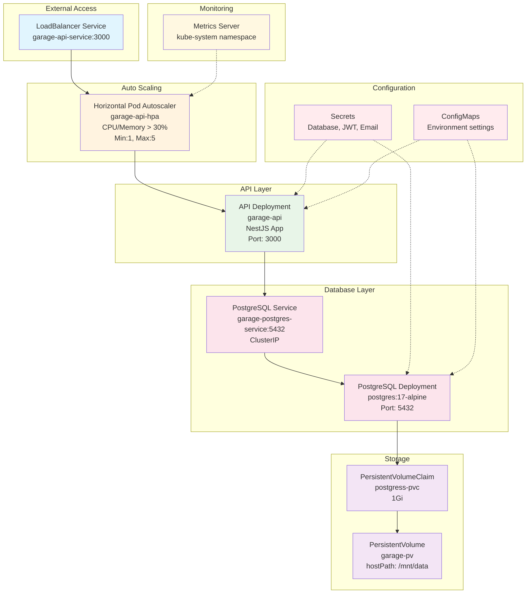

# 🚀 Kubernetes Deployment Guide - FIAP Garage

## 📊 Architecture Overview



### Component Details

| Component              | Type              | Purpose                             | Resources                      |
| ---------------------- | ----------------- | ----------------------------------- | ------------------------------ |
| **API**                | Deployment + HPA  | NestJS application with autoscaling | 512Mi RAM, 250m CPU            |
| **PostgreSQL**         | Deployment        | Database with persistence           | 256Mi-512Mi RAM, 250m-500m CPU |
| **LoadBalancer**       | Service           | External access                     | Port 3000                      |
| **PostgreSQL Service** | ClusterIP Service | Internal database access            | Port 5432                      |
| **Metrics Server**     | System Component  | Resource metrics collection         | kube-system                    |
| **HPA**                | Autoscaler        | Automatic scaling                   | CPU/Memory > 30%               |

## ☸️ 1. Kubernetes Deployment

### Deployment Order (respect dependencies):

#### 1. Create Namespace

```bash
kubectl apply -f k8s/namespace.yaml
```

#### 2. Create Secrets and ConfigMaps

```bash
kubectl apply -f k8s/secret.yaml
kubectl apply -f k8s/configmap.yaml
```

#### 3. Configure Persistence

```bash
kubectl apply -f k8s/pv.yaml
kubectl apply -f k8s/postgress-pvc.yaml
```

#### 4. Deploy PostgreSQL

```bash
kubectl apply -f k8s/postgress-service.yaml
kubectl apply -f k8s/postgres.yaml
```

#### 5. Install Metrics Server (required for HPA)

```bash
kubectl apply -f k8s/metrics.yaml
```

#### 6. Deploy API

```bash
kubectl apply -f k8s/api-service.yaml
kubectl apply -f k8s/api.yaml
```

#### 7. Configure HPA

```bash
kubectl apply -f k8s/hpa.yaml
```

### Verify everything is running:

```bash
# Check pod status
kubectl get pods -n fiap-garage

# Check services
kubectl get services -n fiap-garage

# Check HPA
kubectl get hpa -n fiap-garage

# Verify API responsiveness
kubectl port-forward -n fiap-garage svc/garage-api-service 3000:3000
# In another terminal: curl http://localhost:3000
```

## 🧪 2. Testing Horizontal Pod Autoscaler (HPA)

HPA is configured with:

- **CPU:** Scale when > 30% average utilization
- **Memory:** Scale when > 30% average utilization
- **Min replicas:** 1
- **Max replicas:** 5

### How to test HPA:

#### 1. Prepare test environment:

```bash
# Check initial status
kubectl get hpa garage-api-hpa -n fiap-garage
kubectl get pods -n fiap-garage
```

#### 2. Run stress test:

For local clusters (minikube, kind, k3s), use port forwarding:

```bash
# In one terminal, forward port
kubectl port-forward -n fiap-garage svc/garage-api-service 3000:3000

# In another terminal, run stress test
export API_URL="http://localhost:3000"
./test-hpa.sh 60
```

For cloud clusters with LoadBalancer, get the external IP:

```bash
# Get service details
kubectl get svc garage-api-service -n fiap-garage

# Use the EXTERNAL-IP in the output
export API_URL="http://YOUR-EXTERNAL-IP:3000"
./test-hpa.sh 60
```

Or customize parameters:

```bash
# REQUESTS_PER_SECOND=500 CONCURRENCY=20 ./test-hpa.sh 120
```

#### 3. Monitor scaling:

```bash
# In another terminal, monitor HPA
 kubectl get hpa garage-api-hpa -n fiap-garage -w

# Monitor pods being created
 kubectl get pods -n fiap-garage -w
```

#### 4. Expected behavior during test:

- **Pods scaling:** From 1 to multiple replicas
- **CPU/Memory increasing:** Visible in HPA metrics
- **Stabilization:** Pods should scale down automatically after test

## 🧹 3. Cleanup (if needed)

To remove everything:

```bash
kubectl delete -f k8s/hpa.yaml
kubectl delete -f k8s/api.yaml
kubectl delete -f k8s/api-service.yaml
kubectl delete -f k8s/postgres.yaml
kubectl delete -f k8s/postgress-service.yaml
kubectl delete -f k8s/postgress-pvc.yaml
kubectl delete -f k8s/pv.yaml
kubectl delete -f k8s/secret.yaml
kubectl delete -f k8s/configmap.yaml
kubectl delete -f k8s/metrics.yaml
kubectl delete -f k8s/namespace.yaml
```
