# 🚀 Kubernetes Deployment Guide - FIAP Garage

This guide describes how to deploy the `garage-api` application to a Kubernetes (EKS) cluster configured to connect to an external AWS RDS database.

## 📊 Architecture Overview

The architecture is designed to be decoupled and scalable. The application runs on EKS and leverages a managed AWS RDS instance for its database, which is provisioned and secured by Terraform.

```mermaid
graph TD
    subgraph "Internet"
        LB[AWS LoadBalancer<br/>Service: garage-api-service<br/>Porta: 3000]
    end

    subgraph "AWS EKS Cluster (VPC)"
        subgraph "Auto Scaling"
            HPA[Horizontal Pod Autoscaler<br/>garage-api-hpa<br/>CPU/Memória > 30%<br/>Min:1, Max:5]
        end

        subgraph "API Layer (Private Subnets)"
            API[API Deployment<br/>garage-api<br/>Pods com a App NestJS]
        end

        subgraph "Configuration"
            SEC[Secret<br/>fiap-garage-secret<br/>Credenciais do RDS, JWT, etc.]
            CM[ConfigMap<br/>fiap-garage-config<br/>Configurações de ambiente]
        end

        subgraph "Monitoring"
            MS[Metrics Server]
        end

        LB --> API
        HPA -- controla --> API
        API -- usa --> SEC
        API -- usa --> CM
        MS -- alimenta --> HPA
    end

    subgraph "AWS RDS (VPC - Private Subnets)"
        RDS[PostgreSQL RDS<br/>Instância Gerenciada]
    end

    API -- conecta via endpoint --> RDS

    style LB fill:#e1f5fe
    style HPA fill:#fff3e0
    style API fill:#e8f5e8
    style RDS fill:#fce4ec
    style MS fill:#fff8e1
    style SEC fill:#ffebee
    style CM fill:#ffebee
```



### Component Details

| Component          | Type             | Purpose                             | Resources           |
| ------------------ | ---------------- | ----------------------------------- | ------------------- |
| **API**            | Deployment + HPA | NestJS application with autoscaling | 512Mi RAM, 250m CPU |
| **LoadBalancer**   | Service          | External access                     | Port 3000           |
| **Metrics Server** | System Component | Resource metrics collection         | kube-system         |
| **HPA**            | Autoscaler       | Automatic scaling                   | CPU/Memory > 30%    |

## ☸️ 1. Kubernetes Deployment

The deployment is fully automated via the CI/CD pipeline. However, the steps below outline the manual process.

Note: The fiap-garage-secret is dynamically created by the CI/CD pipeline to inject the live RDS credentials. The secret.yaml file in this repository serves as a template with base64-encoded placeholder values.

### Deployment Order (respect dependencies):

#### 1. Create Namespace

```bash
kubectl apply -f k8s/namespace.yaml
```

#### 2. Create Secrets and ConfigMaps

```bash
kubectl apply -f k8s/secret.yaml
kubectl apply -f k8s/configmap.yaml
```

#### 6. Deploy API

```bash
kubectl apply -f k8s/api-service.yaml
kubectl apply -f k8s/api.yaml
```

#### 5. Install Metrics Server (required for HPA)

```bash
kubectl apply -f k8s/metrics.yaml
```

#### 7. Configure HPA

```bash
kubectl apply -f k8s/hpa.yaml
```

### Verify everything is running:

```bash
# Check pod status (should be "Running")
kubectl get pods -n fiap-garage

# Get the LoadBalancer address (may take a few minutes to populate)
kubectl get service garage-api-service -n fiap-garage

# Check HPA status
kubectl get hpa -n fiap-garage

# Verify API responsiveness
kubectl port-forward -n fiap-garage svc/garage-api-service 3000:3000
# In another terminal: curl http://localhost:3000
```

## 🧪 2. Testing Horizontal Pod Autoscaler (HPA)

HPA is configured with:

- **CPU:** Scale when > 30% average utilization
- **Memory:** Scale when > 30% average utilization
- **Min replicas:** 1
- **Max replicas:** 5

### How to test HPA:

#### 1. Prepare test environment:

```bash
# Check initial status
kubectl get hpa garage-api-hpa -n fiap-garage
kubectl get pods -n fiap-garage
```

#### 2. Run stress test:

For local clusters (minikube, kind, k3s), use port forwarding:

```bash
# In one terminal, forward port
kubectl port-forward -n fiap-garage svc/garage-api-service 3000:3000

# In another terminal, run stress test
export API_URL="http://localhost:3000"
./test-hpa.sh 60
```

For cloud clusters with LoadBalancer, get the external IP:

```bash
# Get service details
kubectl get svc garage-api-service -n fiap-garage

# Use the EXTERNAL-IP in the output
export API_URL="http://YOUR-EXTERNAL-IP:3000"
./test-hpa.sh 60
```

Or customize parameters:

```bash
# REQUESTS_PER_SECOND=500 CONCURRENCY=20 ./test-hpa.sh 120
```

#### 3. Monitor scaling:

```bash
# In another terminal, monitor HPA
 kubectl get hpa garage-api-hpa -n fiap-garage -w

# Monitor pods being created
 kubectl get pods -n fiap-garage -w
```

#### 4. Expected behavior during test:

- **Pods scaling:** From 1 to multiple replicas
- **CPU/Memory increasing:** Visible in HPA metrics
- **Stabilization:** Pods should scale down automatically after test

## 🧹 3. Cleanup (if needed)

To remove everything:

```bash
kubectl delete -f k8s/hpa.yaml
kubectl delete -f k8s/api-service.yaml
kubectl delete -f k8s/api.yaml
kubectl delete -f k8s/configmap.yaml
kubectl delete -f k8s/namespace.yaml
```
